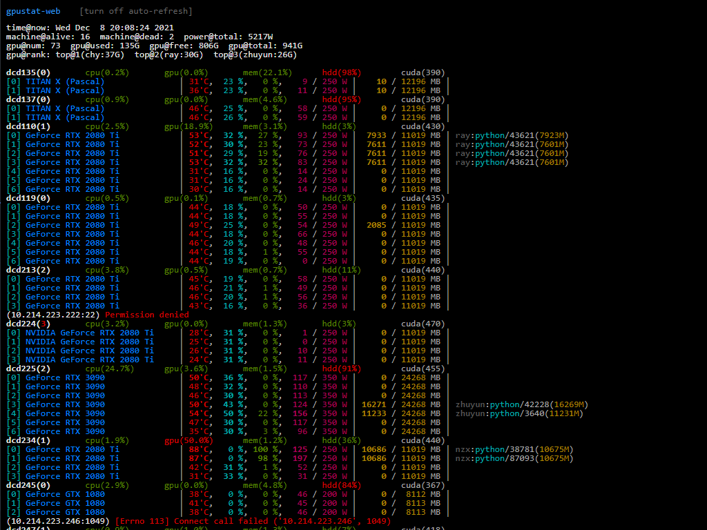

gpustat-web-plus
===========

A web interface across multiple lab server nodes (modify from [wookayin/gpustat-web](https://github.com/wookayin/gpustat-web)).

Usage
-----
1. Add monitored server nodes in the configuration file `config.ini` (refer template `config.ini.template`).
```text
hosts={
  'NODE_NAME': 'USERNAME@IP:PORT'
}
```
2. Make sure ssh can work under a proper authentication scheme such as SSH key (e.g. `id-rsa`).
```bash
ssh-copy-id -pPORT USERNAME@IP
```
3. Install `gpustat` in each monitored server nodes.
```bash
pip install gpustat
which gpustat
sudo cp -r GPUSTAT_PATH /usr/local/bin/
```
4. Start `gpustat-web-plus` web service in the master server node.
```bash
pip install -r requirements.txt
bash run.sh
```

Screenshot
-----

